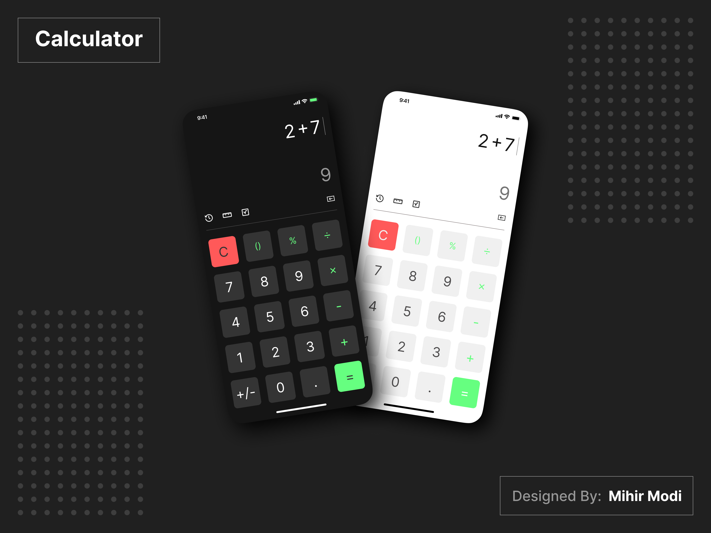

<h1 align="center">JavaScriopt Calculator</h1>

This project is a JavaScript Calculator.

  

## :writing_hand: Author:

- Nicolas Loffi Kaminski

## :rocket: Technologies:

- HTML
- Css
- JavaScript
- Git e GitHub

## :art: Project:

The project <b>JavaScript Calculator</b> is a simple calculator.

### :link: Link

- [Visit the project online](https://nicolaslk.github.io/JavaScript_Calculator/)

## Layout:

Get the project layout through [THIS LINK](https://www.figma.com/community/file/1088822160557084859/Calculator-UI). You need an account on [Figma](https://figma.com) to access.

<b>Note:</b> Some buttons have changed compared <em>to the layout.</em>
